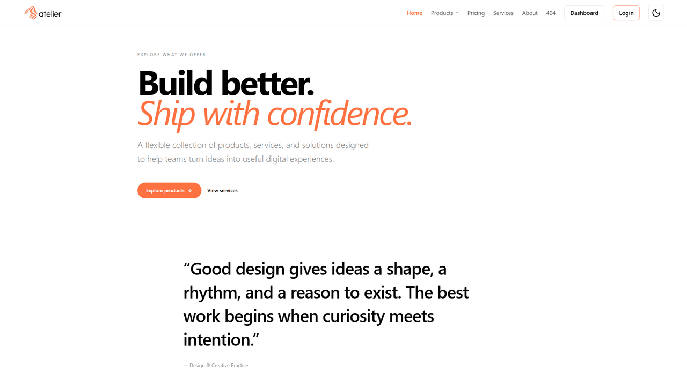
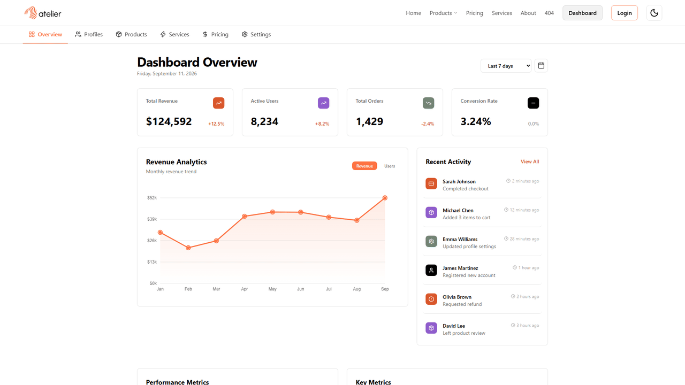

# ✨ Atelier — Editorial Design Studio

> A modern design-system showcase and portfolio site with admin dashboard. Built with **React 19**, **Vite 8**, **Tailwind CSS v4**, **Laravel 12**, and **Three.js**.

<p align="center">
  <a href="#"></a>
  <a href="#"></a>
  <a href="#"></a>
  <a href="#"></a>
  <a href="#"></a>
</p>

<p align="center">
  
</p>

<p align="center">
  
</p>

---

## 🚀 Features

| Feature                        | Details                                               |
| ------------------------------ | ----------------------------------------------------- |
| 🌓 **Dark / Light Mode**       | `next-themes` + Tailwind v4                           |
| 🔗 **Hash Routing**            | Product, pricing, and service showcase pages          |
| 🔐 **Authentication**          | Laravel Sanctum personal access tokens                |
| 📊 **Admin Dashboard**         | CRUD management for products, services, pricing plans |
| 🔄 **Mock/API Data Switching** | Dual deployment modes with automatic fallback         |
| 👤 **User Profile Management** | Update profile fields and change password             |

---

## 🏗️ Architecture

This project consists of **two independent repositories**:

| Repository          | Purpose               | Tech Stack                    |
| ------------------- | --------------------- | ----------------------------- |
| `editorial-web`     | React + Vite frontend | React 19, Vite 8, Tailwind v4 |
| `editorial-backend` | Laravel REST API      | Laravel 12, PHP 8.2+, MySQL   |

### Deployment Modes

| Mode               | Env Var                 | Data Source              | Requires Backend? |
| ------------------ | ----------------------- | ------------------------ | ----------------- |
| **A — Mock/Demo**  | `VITE_DATA_SOURCE=mock` | Local JS mock data       | No                |
| **B — Production** | `VITE_DATA_SOURCE=api`  | Laravel REST API + MySQL | Yes               |

### Mock Data Fallback

All dashboard pages use **mock data as fallback** when API requests fail (not authenticated, API unavailable, or network error). Pages remain fully accessible without authentication during development.

---

## 🔐 Authentication Features

Current implementation (Phases 0-14 complete):

- ✅ **User Registration** — `POST /api/register`
- ✅ **User Login** — `POST /api/login`
- ✅ **Get Current User** — `GET /api/user` (protected)
- ✅ **Logout** — `POST /api/logout` (protected)
- ✅ **Update Profile** — `PUT /api/user/profile` (protected)
- ✅ **Change Password** — `PUT /api/user/password` (protected)

**Note:** Dashboard routes are currently **public** during development. Protected route examples are commented in `App.jsx` and can be enabled for Phase 15/16.

---

## ⚡ Quick Start

### Frontend Only (Mock Mode)

```bash
# Install dependencies
npm install

# Start dev server (uses mock data)
npm run dev

# Build for production
npm run build

# Preview build
npm run preview
```

### Full Stack (API Mode)

**Prerequisites:**

- PHP 8.2+, Composer, MySQL
- Laravel backend repository: `editorial-backend`

**Backend Setup:**

```bash
# Navigate to backend directory
cd editorial-backend

# Install dependencies
composer install

# Setup environment
cp .env.example .env
php artisan key:generate

# Configure database in .env
# DB_DATABASE=editorial
# DB_USERNAME=your_username
# DB_PASSWORD=your_password

# Run migrations
php artisan migrate

# Seed sample data (optional)
php artisan db:seed

# Start Laravel server
php artisan serve
# Runs on http://localhost:8000
```

**Frontend Setup:**

```bash
# Navigate to frontend directory
cd editorial-web

# Install dependencies
npm install

# Create .env file
echo "VITE_DATA_SOURCE=api" > .env
echo "VITE_API_URL=/api" >> .env
echo "VITE_API_TIMEOUT=2000" >> .env

# Start Vite dev server
npm run dev
# Runs on http://localhost:5173
# Proxies /api requests to backend automatically
```

---

## 🌍 Environment Variables

### Frontend (.env)

```env
# Data source mode
VITE_DATA_SOURCE=mock          # Use mock data (no backend required)
VITE_DATA_SOURCE=api           # Use Laravel API

# API configuration (only needed in API mode)
VITE_API_URL=/api              # Local dev (proxied to localhost:8000)
VITE_API_URL=https://api.example.com/api  # Production backend
VITE_API_TIMEOUT=2000          # Request timeout in milliseconds
```

**Note:** Vite dev server automatically proxies `/api` requests to `http://localhost:8000` for local development (no CORS configuration needed).

---

## 📁 Project Structure

```
src/
  components/     — reusable UI components
    ui/           — generic UI (Button, Card, Badge, Input)
    navigation/   — Navbar, Sidebar, Tabs, Breadcrumb
    feedback/     — Modal, Toast, Loading, EmptyState
    data-management/ — EntityFormModal, EntityCard, CRUD components
  sections/       — reusable landing-page sections (Hero, Features, CTA...)
  pages/          — complete pages
    landing/      — landing page
    auth/         — login, register, forgot password
    dashboard/    — dashboard pages with DashboardLayout
    dashboard2/   — alternative dashboard with DashboardSidebarLayout
    product/      — product showcase pages
    pricing/      — pricing pages
    service/      — service pages
    about/        — about pages
    error/        — 404, unauthorized pages
  layouts/        — reusable page layouts (DashboardLayout, etc.)
  services/       — API integration layer
    api/          — auth.js, products.js, services.js, pricing.js, config.js
    data.js       — data source abstraction with mock fallback
  animations/     — shared animation definitions
  hooks/          — custom React hooks (useEntityCrud, etc.)
  lib/            — utilities and helper functions
  data/           — static/mock data (exampleData.js)
```

---

## 🛠 Tech Stack

### Frontend

| Layer         | Technology                   |
| ------------- | ---------------------------- |
| Framework     | React 19                     |
| Build Tool    | Vite 8                       |
| Styling       | Tailwind CSS v4              |
| Routing       | react-router-dom v7          |
| 3D / Graphics | Three.js + React Three Fiber |
| Animation     | GSAP + Motion                |
| Icons         | Lucide React                 |
| Theme         | next-themes                  |

### Backend

| Layer          | Technology           |
| -------------- | -------------------- |
| Framework      | Laravel 12           |
| Language       | PHP 8.2+             |
| Database       | MySQL                |
| Authentication | Laravel Sanctum ^4.3 |
| API            | RESTful JSON API     |

---

## 📡 API Endpoints

| Method | Endpoint             | Description         | Auth Required |
| ------ | -------------------- | ------------------- | ------------- |
| GET    | `/api/health`        | Health check        | No            |
| POST   | `/api/register`      | Register new user   | No            |
| POST   | `/api/login`         | Login user          | No            |
| GET    | `/api/user`          | Get current user    | Yes           |
| POST   | `/api/logout`        | Logout user         | Yes           |
| PUT    | `/api/user/profile`  | Update profile      | Yes           |
| PUT    | `/api/user/password` | Change password     | Yes           |
| GET    | `/api/products`      | List products       | No            |
| POST   | `/api/products`      | Create product      | No\*          |
| PUT    | `/api/products/{id}` | Update product      | No\*          |
| DELETE | `/api/products/{id}` | Delete product      | No\*          |
| GET    | `/api/services`      | List services       | No            |
| POST   | `/api/services`      | Create service      | No\*          |
| PUT    | `/api/services/{id}` | Update service      | No\*          |
| DELETE | `/api/services/{id}` | Delete service      | No\*          |
| GET    | `/api/pricing`       | List pricing plans  | No            |
| POST   | `/api/pricing`       | Create pricing plan | No\*          |
| PUT    | `/api/pricing/{id}`  | Update pricing plan | No\*          |
| DELETE | `/api/pricing/{id}`  | Delete pricing plan | No\*          |

\* _Will be protected in Phase 16_

---

## 📋 Development Status

### Completed Phases (0-14)

- ✅ Phase 0-7: Project setup, Laravel API, React integration, CRUD operations
- ✅ Phase 8-10: Authentication architecture, database updates, Sanctum configuration
- ✅ Phase 11-14: Registration, login, logout, profile management

### Upcoming Phases (15-17)

- ⬜ Phase 15: React Authentication Context/Provider
- ⬜ Phase 16: Protected Routes & Authorization
- ⬜ Phase 17: Full Authentication Testing

See `PROJECT_PLAN.md` for detailed phase-by-phase progress and implementation notes.

---

## 🚀 Deployment

### Vercel (Mock Mode)

The frontend can be deployed to Vercel without the backend:

- Leave `VITE_DATA_SOURCE` unset or set to `mock`
- No environment variables required
- Dashboard automatically uses mock data
- Perfect for demos and portfolio showcases

### Production (API Mode)

For full-stack deployment with Laravel backend:

1. **Deploy Backend**: Follow deployment guide in `editorial-backend` repository
2. **Configure Frontend Environment**:
   ```env
   VITE_DATA_SOURCE=api
   VITE_API_URL=https://api.yourdomain.com/api
   VITE_API_TIMEOUT=5000
   ```
3. **Configure CORS**: Set `FRONTEND_URL` in backend `.env` to match your frontend domain
4. **Deploy Frontend**: Build and deploy to your hosting provider

See `PROJECT_PLAN.md` → "Future Task — Deploy to Real Host" for detailed deployment instructions.

---

## 🔗 Related Documentation

- **PROJECT_PLAN.md** — Detailed project roadmap, phase-by-phase implementation notes, and architectural decisions
- **editorial-backend** — Separate repository for Laravel REST API

---

## 📄 License

Private project — built for editorial and design exploration.

---

**Built with ❤️ using React, Vite, Tailwind CSS v4, Laravel, and Three.js**
